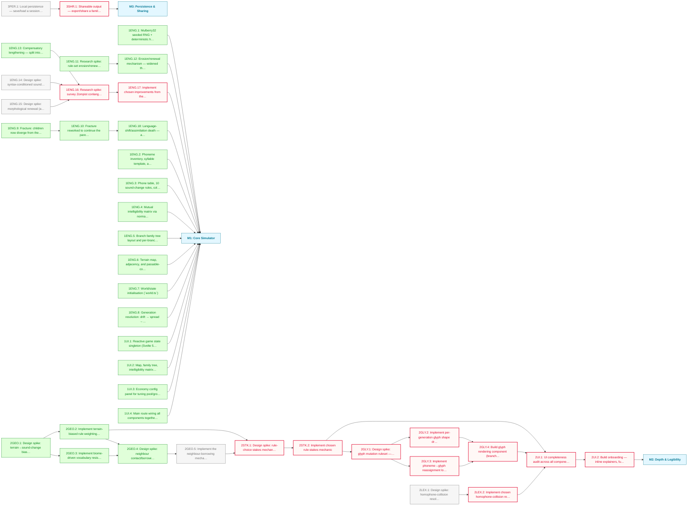

# The Tongue: MVP Roadmap

A seeded, deterministic language-evolution simulator: sound-change rules drift a lexicon across autonomously drifting, spreading and fracturing branches, tracked through a mutual-intelligibility matrix. Milestone 1 (Core Simulator) is nearly complete; Milestone 2 (Depth & Legibility) is queued behind a chain of design spikes; Milestone 3 (Persistence & Sharing) is a deliberately deferred stub.

**Critical path:** `2GEO.5 → 2STK.1 → 2STK.2 → 2GLY.1 → {2GLY.2, 2GLY.3} → 2GLY.4 → 2UI.1 → 2UI.2` — the longest unblocked chain through Milestone 2, gating the onboarding pass on stakes, glyphs and the homophone-resolution mechanic.

---

## Milestone 1 — Core Simulator

**Goal:** A playable, deterministic language-evolution simulator — seeded world generation, sound-change rules, territory expansion, autonomous drift/spread/fracture, and a mutual intelligibility matrix.

- [x] **1ENG.1** — Mulberry32 seeded RNG + deterministic hash for autonomous replay (`rng.ts`)
- [x] **1ENG.2** — Phoneme inventory, syllable template, and 32-concept lexicon generation (`lexicon.ts`)
- [x] **1ENG.3** — Phone table, 10 sound-change rules, collision/homophone detection (`phonology.ts`)
- [x] **1ENG.4** — Mutual intelligibility matrix via normalised edit distance (`intelligibility.ts`)
- [x] **1ENG.5** — Branch family tree layout and per-branch colour generation (`tree.ts`)
- [x] **1ENG.6** — Terrain map, adjacency, and passable-component detection (`geography.ts`)
- [x] **1ENG.7** — World/state initialisation (`world.ts`)
- [x] **1ENG.8** — Generation resolution: drift → spread → fracture → repool (`generation.ts`)
- [x] **1ENG.11** — Research spike: rule-set erosion/renewal balance — diagnosed why the purely-reductive `RULES` ossify a branch after a few generations, surveyed real diachronic renewal mechanisms (epenthesis, vowel breaking/diphthongisation, monophthongisation, vowel shortening), and produced a build-ready contract for 1ENG.12 (`docs/spikes/1eng-11-erosion-renewal.md`)
- [x] **1ENG.12** — Erosion/renewal mechanism — widened the phonology transducer to a 1→N segment model, added real diphthong/long-vowel phones (seeded into starting inventories too), and added `epenth`/`break`/`paragoge` (renewal) plus `smooth`/`shorten` (erosion of the new structure) rules. Testing during implementation found the spike's original mid-vowel-conditioned `break` couldn't bootstrap from a fully-eroded lexicon (~97% of turns still ossified); corrected to an unconditioned `break` + new `paragoge` rule, which together guarantee every word has a live renewal move — verified at 0 ossified turns across 150-turn/multi-seed end-to-end sweeps (`docs/spikes/1eng-11-erosion-renewal.md`, `phonology.ts`) _(depends on 1ENG.11)_
- [x] **1ENG.9** — Fracture: children now diverge from the parent at the moment of fracture via a seeded birth drift step against the post-split owner map, instead of starting as exact lexicon copies (`generation.ts`)
- [x] **1ENG.10** — Fracture reworked to continue the parent lineage on its largest surviving component (ties broken by lowest region id) instead of retiring the parent and minting a fresh branch per component; only the other component(s) spin off as new siblings. Added a divergence-threshold rename mechanic: every branch accrues a flat chain of drift anchors (`Anchor`), and a new `naming.ts` module renders them at display time via an event-density-aware perspective-collapse into Old/Middle/Late era names and `Proto-<blend>` names for shared ancestors of genuinely diverged descendants — bare stems for living tips. Branch names are now generated phonotactically from each branch's own inventory (`naming.ts` `genStem`) instead of drawn from a static pool. Surfaced and fixed a latent bug in `isLeaf`/`leavesOf` (previously "childless", which silently broke once a still-territory-owning branch could also have children) and a `root.name` placeholder ("Proto") colliding with the new Proto- naming vocabulary (`generation.ts`, `naming.ts`, `tree.ts`, `world.ts`) _(depends on 1ENG.9)_
- [x] **1ENG.18** — Language-shift/assimilation death — a much smaller branch bordering (via a passable edge) a near-identical, much larger neighbour (intelligibility above a cutoff, size ratio below a threshold) sustained over several turns has its territory absorbed into that neighbour and becomes a dead ancestor. Closes a gap surfaced after 1ENG.10 shipped: nothing in the engine previously emptied a branch's territory, so the Old/Middle/Late/Proto- era-naming payoff was unreachable in play — this makes it reachable via a real historical death pattern (Cornish, Manx) rather than territory conquest, keeping clear of 2GEO.4's planned neighbour-contact/borrowing scope. New `geography.ts` `neighborsOf`/`dominantAssimilator` helpers, a new turn-loop step in `generation.ts` (after spread, before fracture), and a UI warning mirroring the existing fracture warning (`game.svelte.ts`, `+page.svelte`) _(depends on 1ENG.10)_
- [x] **1UI.1** — Reactive game state singleton (Svelte 5 runes) (`game.svelte.ts`)
- [x] **1UI.2** — Map, family tree, intelligibility matrix, word table, change list, history panels
- [x] **1UI.3** — Economy config panel for tuning pool/growth/overhead/cost settings
- [x] **1UI.4** — Main route wiring all components together (`+page.svelte`)
- [x] **1ENG.13** — Compensatory lengthening — split into `compleng` (medial coda in a cluster, `V _ C`, e.g. kast→kaːt) and `complengFinal` (word-final coda, `V _ #`, e.g. tas→taː), mirroring the epenth/paragoge medial/final split; both fire on the coda and use a new `Rule.lengthensPrev` flag so `applyRuleToWord` reaches back and lengthens the vowel it already emitted — the 1ENG.11 spike §8 claim that `Seg[]` already supported this was inaccurate (corrected in the spike doc)
- [ ] **1ENG.14** — Design spike: syntax-conditioned sound change — many real sound changes are conditioned by the preceding/following *word*, not just the preceding/following phoneme (sandhi, cross-word assimilation/liaison); the engine currently has no representation of word order or utterance-level context at all (each lexicon entry is an isolated concept→word mapping). Needs its own spike to define a minimal syntax/adjacency model before any cross-word rule can be built
- [ ] **1ENG.15** — Design spike: morphological renewal (agreement/tense) — noun-verb agreement and grammatical tense marking are a major real-world source of the vocabulary/sound variety that keeps a language's phonology alive (paradigms, inflectional affixes); named but explicitly out-of-scope in the 1ENG.11 spike (§8) as belonging with 2GEO.4/borrowing. Needs a spike to define a minimal inflectional-paradigm model before implementation
- [ ] **1ENG.16** — Research spike: survey Zompist conlang tools ([SCA](https://www.zompist.com/sca2.html), [Gen](https://www.zompist.com/gen.html), [Phono](https://www.zompist.com/phono.html), [GGG](https://www.zompist.com/ggg.html), [GTG](https://www.zompist.com/gtg.html), [MG](https://www.zompist.com/mg.html)) for mechanisms and approaches applicable to our own engine — sound-change rule notation and batch application (SCA), procedural word/name generation (Gen), phonology description conventions (Phono), and general conlanging methodology (GGG, GTG, MG); produce a build-ready contract for 1ENG.17 identifying which findings are worth adopting _(blocked — depends on 1ENG.13, 1ENG.14, 1ENG.15)_
- [ ] **1ENG.17** — Implement chosen improvements from the Zompist tools survey *(placeholder — depends on 1ENG.16)* _(blocked — depends on 1ENG.16)_

---

## Milestone 2 — Depth & Legibility

**Goal:** Make geography causally shape language change, give sound-change choices real stakes, add a diegetic evolving-glyph writing system, and make every player-facing decision legible — starting with an onboarding pass informed by all of the above.

- [x] **2GEO.1** — Design spike: terrain→sound-change bias ruleset — split into a social-geography contact/isolation axis (sound change) and a physical-geography terrain axis (semantic salience), with a full implementation contract for 2GEO.2 and 2GEO.3 (`docs/spikes/2geo-1-terrain-sound-change.md`)
- [x] **2GEO.2** — Implement terrain-biased rule weighting in `phonology.ts` — contract specified in the 2GEO.1 spike _(depends on 2GEO.1)_
- [x] **2GEO.3** — Implement biome-driven vocabulary resistance — terrain-salient concepts (`salienceRetention` in `lexicon.ts`) drift/replace more slowly, gating word-level drift in `applyRuleToLex` (`phonology.ts`) — contract specified in the 2GEO.1 spike, Axis B minimum scope (iii) _(depends on 2GEO.1)_
- [x] **2GEO.4** — Design spike: neighbour contact/borrowing mechanic — bordering branches converge via borrowing, the one convergent force in an otherwise all-divergent turn loop (drift, fracture and assimilation-death all pull branches apart or remove one). Specifies a directional per-ordered-pair mechanic: eligibility gated on the lender's terrain-salient concepts (`salienceRetention`/`dominantTerrain` — the borrowable subset of an otherwise borrowing-resistant basic list, per Tadmor/WOLD), selection of the most-divergent eligible concept, a pair-local contact throttle (passable A–B edges as a share of A's border), and a contact-graded outcome (faithful whole-copy at high contact, one-step adaptation at low contact — contact proxying bilingual proficiency, per Thomason & Kaufman). Salient concepts thus resist drift *and* attract borrowing (the real Wanderwort profile). Full build-ready contract for 2GEO.5, following the 2GEO.1 pattern (`docs/spikes/2geo-4-neighbour-contact-borrowing.md`) _(depends on 2GEO.2, 2GEO.3)_
- [ ] **2GEO.5** — Implement the neighbour-borrowing mechanic — new `borrowing.ts` (`resolveBorrow`, `BORROW_RATE`, `BORROW_FAITHFUL_CUT`), `pairContact` in `geography.ts`, `formSimilarity` factored out of `intelligibility.ts`, `borrowableConcepts`/`stepToward` beside the salience helpers, and a new turn-loop step 3.5 in `generation.ts` (after spread, before assimilation). No new randomness beyond a fresh `hashRand` salt; seeded replay preserved — contract specified in the 2GEO.4 spike _(depends on 2GEO.4)_
- [ ] **2LEX.1** — Design spike: homophone-collision resolution mechanic — how a real semantic collision between two concepts (`homophoneForms`/`collisionPairs` in `phonology.ts`, currently only previewed before a player picks a rule) gets resolved once it actually lands during drift — candidates include a forced disambiguating follow-up change, a tolerated real homophone surfaced in UI/narrative, a borrowed synonym, or compounding — informed by real linguistics on homophone avoidance/tolerance
- [ ] **2STK.1** — Design spike: rule-choice stakes mechanic (resource trade-offs vs directional goals vs prerequisite chains) _(blocked — depends on 2GEO.2, 2GEO.5)_
- [ ] **2STK.2** — Implement chosen rule-stakes mechanic _(blocked — depends on 2STK.1)_
- [ ] **2GLY.1** — Design spike: glyph mutation ruleset — shape-drift grammar + phoneme→glyph reassignment rules, referencing real script lineages (e.g. Phoenician → Greek → Etruscan → Latin) _(blocked — depends on 2STK.2)_
- [ ] **2GLY.2** — Implement per-generation glyph shape drift (independent stylistic mutation) _(blocked — depends on 2GLY.1)_
- [ ] **2GLY.3** — Implement phoneme→glyph reassignment logic, tied to phone split/merge/deletion from phonology rules _(blocked — depends on 2GLY.1)_
- [ ] **2GLY.4** — Build glyph rendering component (branch-level script display) _(blocked — depends on 2GLY.2, 2GLY.3)_
- [ ] **2LEX.2** — Implement chosen homophone-collision resolution mechanic _(blocked — depends on 2LEX.1)_
- [ ] **2UI.1** — UI completeness audit across all components — existing panels plus new biome/stakes/glyph/lexicon data — verify every player-facing decision has a legible data source _(blocked — depends on 2STK.2, 2GLY.4, 2LEX.2)_
- [ ] **2UI.2** — Build onboarding — inline explainers, full tutorial mode, and a UI layout rethink, informed by the audit findings _(blocked — depends on 2UI.1)_

---

## Milestone 3 — Persistence & Sharing

**Goal:** Survive a page refresh and let players show their results to someone else. Deferred out of Milestone 2 to keep that milestone focused purely on simulation depth and legibility — stubbed here so the intent isn't lost.

- [ ] **3PER.1** — Local persistence — save/load a session via `localStorage`
  - Note: Placeholder — deferred from Milestone 2
- [ ] **3SHR.1** — Shareable output — export/share a family tree or result (image, link, or data export) _(blocked — depends on 3PER.1)_
  - Note: Placeholder — deferred from Milestone 2

---

## Dependency Diagram

---

## Links

- [README](../../README.md)
- [Engine source](../../src/lib/engine/)
- Live: https://the-tongue.vercel.app

---

## Beyond MVP

- Writing-system variance beyond phonemic: logographic, alphabetic, abjad glyph sets coexisting per branch (flagged during 2GLY interview, deliberately scoped down to phonemic-only for Milestone 2)
- Climate/terrain-coded phonology (contested in real linguistics — treat as flavour only if ever pursued)
