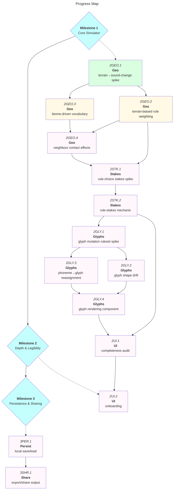

# The Tongue: MVP Roadmap

|            | Status                    | Next Up                          | Blocked |
| ---------- | -------------------------- | --------------------------------- | ------- |
| **Core**   | ✅ Milestone 1 complete    | —                                  | —       |
| **Geo**    | 🔸 2GEO.1 complete          | 2GEO.2, 2GEO.3                    | —       |
| **Stakes** | Not started                 | 2STK.1 design spike               | 2GEO.2, 2GEO.4 |
| **Glyphs** | Not started                 | 2GLY.1 design spike               | 2STK.2  |
| **UI**     | Not started                 | 2UI.1 audit                       | 2STK.2, 2GLY.4 |

---

## Contents

- [Milestones](#milestones)
  - [Milestone 1: Core Simulator](#m1)
  - [Milestone 2: Depth & Legibility](#m2)
  - [Milestone 3: Persistence & Sharing](#m3)
- [Progress Map](#map)
- [Links](#links)
- [Beyond MVP](#post-mvp)

---

<a name="m1"><h3>Milestone 1: Core Simulator</h3></a>

> [!IMPORTANT]
> **Goal:** A playable, deterministic language-evolution simulator — seeded world generation, sound-change rules, territory expansion, autonomous drift/spread/fracture, and a mutual intelligibility matrix.

<a name="m1-done"><h4>Completed (Milestone 1)</h4></a>

- [x] 1ENG.1. Mulberry32 seeded RNG + deterministic hash for autonomous replay (`rng.ts`)
- [x] 1ENG.2. Phoneme inventory, syllable template, and 32-concept lexicon generation (`lexicon.ts`)
- [x] 1ENG.3. Phone table, 10 sound-change rules, collision/homophone detection (`phonology.ts`)
- [x] 1ENG.4. Mutual intelligibility matrix via normalised edit distance (`intelligibility.ts`)
- [x] 1ENG.5. Branch family tree layout and per-branch colour generation (`tree.ts`)
- [x] 1ENG.6. Terrain map, adjacency, and passable-component detection (`geography.ts`)
- [x] 1ENG.7. World/state initialisation (`world.ts`)
- [x] 1ENG.8. Generation resolution: drift → spread → fracture → repool (`generation.ts`)
- [x] 1UI.1. Reactive game state singleton (Svelte 5 runes) (`game.svelte.ts`)
- [x] 1UI.2. Map, family tree, intelligibility matrix, word table, change list, history panels
- [x] 1UI.3. Economy config panel for tuning pool/growth/overhead/cost settings
- [x] 1UI.4. Main route wiring all components together (`+page.svelte`)

---

<a name="m2"><h3>Milestone 2: Depth & Legibility</h3></a>

> [!IMPORTANT]
> **Goal:** Make geography causally shape language change, give sound-change choices real stakes, add a diegetic evolving-glyph writing system, and make every player-facing decision legible — starting with an onboarding pass informed by all of the above.

<a name="m2-done"><h4>Completed (Milestone 2)</h4></a>

- [x] 2GEO.1. Design spike: terrain→sound-change bias ruleset — split into a social-geography contact/isolation axis (sound change) and a physical-geography terrain axis (semantic salience), with a full implementation contract for 2GEO.2 and 2GEO.3 (`docs/spikes/2geo-1-terrain-sound-change.md`)

<a name="m2-todo"><h4>To Do (Milestone 2)</h4></a>

- [ ] 2GEO.2. Implement terrain-biased rule weighting in `phonology.ts` — contract specified in the 2GEO.1 spike
- [ ] 2GEO.3. Implement biome-driven vocabulary expansion — concepts useful to a region's terrain drift/expand preferentially — contract specified in the 2GEO.1 spike

<a name="m2-blocked"><h4>Blocked (Milestone 2)</h4></a>

- [ ] 2GEO.4. Implement neighbour contact effects — bordering branches converge via borrowing, not just diverge — **depends on 2GEO.2, 2GEO.3**
- [ ] 2STK.1. Design spike: rule-choice stakes mechanic (resource trade-offs vs directional goals vs prerequisite chains) — **depends on 2GEO.2, 2GEO.4**
- [ ] 2STK.2. Implement chosen rule-stakes mechanic — **depends on 2STK.1**
- [ ] 2GLY.1. Design spike: glyph mutation ruleset — shape-drift grammar + phoneme→glyph reassignment rules, referencing real script lineages (e.g. Phoenician → Greek → Etruscan → Latin) — **depends on 2STK.2**
- [ ] 2GLY.2. Implement per-generation glyph shape drift (independent stylistic mutation) — **depends on 2GLY.1**
- [ ] 2GLY.3. Implement phoneme→glyph reassignment logic, tied to phone split/merge/deletion from phonology rules — **depends on 2GLY.1**
- [ ] 2GLY.4. Build glyph rendering component (branch-level script display) — **depends on 2GLY.2, 2GLY.3**
- [ ] 2UI.1. UI completeness audit across all components — existing panels plus new biome/stakes/glyph data — verify every player-facing decision has a legible data source — **depends on 2STK.2, 2GLY.4**
- [ ] 2UI.2. Build onboarding — inline explainers, full tutorial mode, and a UI layout rethink, informed by the audit findings — **depends on 2UI.1**

---

<a name="m3"><h3>Milestone 3: Persistence & Sharing</h3></a>

> [!IMPORTANT]
> **Goal:** Survive a page refresh and let players show their results to someone else. Deferred out of Milestone 2 to keep that milestone focused purely on simulation depth and legibility — stubbed here so the intent isn't lost.

<a name="m3-blocked"><h4>Blocked (Milestone 3)</h4></a>

- [ ] 3PER.1. Local persistence — save/load a session via `localStorage` *(placeholder — deferred from Milestone 2)*
- [ ] 3SHR.1. Shareable output — export/share a family tree or result (image, link, or data export) — **depends on 3PER.1** *(placeholder — deferred from Milestone 2)*

---

<a name="map"><h3>Progress Map</h3></a>

---

<a name="links"><h3>Links</h3></a>

- [README](../../README.md)
- [Engine source](../../src/lib/engine/)
- Live: https://the-tongue.vercel.app

---

<a name="post-mvp"><h3>Beyond MVP</h3></a>

- Writing-system variance beyond phonemic: logographic, alphabetic, abjad glyph sets coexisting per branch (flagged during 2GLY interview, deliberately scoped down to phonemic-only for Milestone 2)
- Climate/terrain-coded phonology (contested in real linguistics — treat as flavour only if ever pursued)
