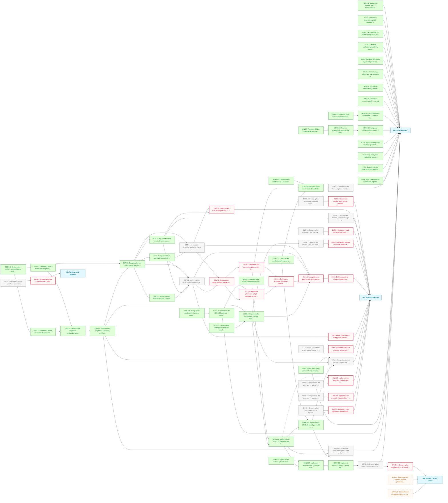

# The Tongue: MVP Roadmap

A seeded, deterministic language-evolution simulator: sound-change rules drift a lexicon across autonomously drifting, spreading and fracturing branches, tracked through a mutual-intelligibility matrix. Milestone 1 (Core Simulator) is nearly complete; Milestone 2 (Depth & Legibility) is queued behind a chain of design spikes; Milestone 3 (Persistence & Sharing) is a deliberately deferred stub. Milestone 4 (Beyond Current Scope) ships nothing: it holds work a spike judged too costly for its value now, kept so the reasoning survives.

**Critical path:** `2GEO.5 → 2STK.1 → 2STK.2 → 2STK.6 → 2GLY.1 → {2GLY.2, 2GLY.3} → 2GLY.4 → 2UI.1 → 2UI.2` — the longest unblocked chain through Milestone 2, gating the onboarding pass on stakes, glyphs and the homophone-resolution mechanic. (The stakes implementation is split across `2STK.2`–`2STK.6` per the [2stk-1 spike](../spikes/2stk-1-rule-choice-stakes.md); `2STK.6` is the chain's sink because the economy sweeps need identity, momentum and contact landed first.)

**Priority call (design-analysis, "three roadmap edits"):** the seed text (`2NAR.1`/`2NAR.2`) and the chronicle (`2NAR.3`/`2NAR.4`) sit off the critical path above but are recommended ahead of the glyph chain (`2GLY.*`) in build order — both are cheap, pure-presentation features over already-shipped state, delivering more theme per week than four tasks of glyph spectacle. Not a structural dependency; a sequencing preference only.

---

## Milestone 1 — Core Simulator

**Goal:** A playable, deterministic language-evolution simulator — seeded world generation, sound-change rules, territory expansion, autonomous drift/spread/fracture, and a mutual intelligibility matrix.

- [x] **1ENG.1** — Mulberry32 seeded RNG + deterministic hash for autonomous replay (`rng.ts`)
- [x] **1ENG.2** — Phoneme inventory, syllable template, and 32-concept lexicon generation (`lexicon.ts`)
- [x] **1ENG.3** — Phone table, 10 sound-change rules, collision/homophone detection (`phonology.ts`)
- [x] **1ENG.4** — Mutual intelligibility matrix via normalised edit distance (`intelligibility.ts`)
- [x] **1ENG.5** — Branch family tree layout and per-branch colour generation (`tree.ts`)
- [x] **1ENG.6** — Terrain map, adjacency, and passable-component detection (`geography.ts`)
- [x] **1ENG.7** — World/state initialisation (`world.ts`)
- [x] **1ENG.8** — Generation resolution: drift → spread → fracture → repool (`generation.ts`)
- [x] **1ENG.11** — Research spike: rule-set erosion/renewal balance — diagnosed why the purely-reductive `RULES` ossify a branch after a few generations, surveyed real diachronic renewal mechanisms (epenthesis, vowel breaking/diphthongisation, monophthongisation, vowel shortening), and produced a build-ready contract for 1ENG.12 (`docs/spikes/1eng-11-erosion-renewal.md`)
- [x] **1ENG.12** — Erosion/renewal mechanism — widened the phonology transducer to a 1→N segment model, added real diphthong/long-vowel phones (seeded into starting inventories too), and added `epenth`/`break`/`paragoge` (renewal) plus `smooth`/`shorten` (erosion of the new structure) rules. Testing during implementation found the spike's original mid-vowel-conditioned `break` couldn't bootstrap from a fully-eroded lexicon (~97% of turns still ossified); corrected to an unconditioned `break` + new `paragoge` rule, which together guarantee every word has a live renewal move — verified at 0 ossified turns across 150-turn/multi-seed end-to-end sweeps (`docs/spikes/1eng-11-erosion-renewal.md`, `phonology.ts`) _(depends on 1ENG.11)_
- [x] **1ENG.9** — Fracture: children now diverge from the parent at the moment of fracture via a seeded birth drift step against the post-split owner map, instead of starting as exact lexicon copies (`generation.ts`)
- [x] **1ENG.10** — Fracture reworked to continue the parent lineage on its largest surviving component (ties broken by lowest region id) instead of retiring the parent and minting a fresh branch per component; only the other component(s) spin off as new siblings. Added a divergence-threshold rename mechanic: every branch accrues a flat chain of drift anchors (`Anchor`), and a new `naming.ts` module renders them at display time via an event-density-aware perspective-collapse into Old/Middle/Late era names and `Proto-<blend>` names for shared ancestors of genuinely diverged descendants — bare stems for living tips. Branch names are now generated phonotactically from each branch's own inventory (`naming.ts` `genStem`) instead of drawn from a static pool. Surfaced and fixed a latent bug in `isLeaf`/`leavesOf` (previously "childless", which silently broke once a still-territory-owning branch could also have children) and a `root.name` placeholder ("Proto") colliding with the new Proto- naming vocabulary (`generation.ts`, `naming.ts`, `tree.ts`, `world.ts`) _(depends on 1ENG.9)_
- [x] **1ENG.18** — Language-shift/assimilation death — a much smaller branch bordering (via a passable edge) a near-identical, much larger neighbour (intelligibility above a cutoff, size ratio below a threshold) sustained over several turns has its territory absorbed into that neighbour and becomes a dead ancestor. Closes a gap surfaced after 1ENG.10 shipped: nothing in the engine previously emptied a branch's territory, so the Old/Middle/Late/Proto- era-naming payoff was unreachable in play — this makes it reachable via a real historical death pattern (Cornish, Manx) rather than territory conquest, keeping clear of 2GEO.4's planned neighbour-contact/borrowing scope. New `geography.ts` `neighborsOf`/`dominantAssimilator` helpers, a new turn-loop step in `generation.ts` (after spread, before fracture), and a UI warning mirroring the existing fracture warning (`game.svelte.ts`, `+page.svelte`) _(depends on 1ENG.10)_
- [x] **1UI.1** — Reactive game state singleton (Svelte 5 runes) (`game.svelte.ts`)
- [x] **1UI.2** — Map, family tree, intelligibility matrix, word table, change list, history panels
- [x] **1UI.3** — Economy config panel for tuning pool/growth/overhead/cost settings
- [x] **1UI.4** — Main route wiring all components together (`+page.svelte`)
- [x] **1ENG.13** — Compensatory lengthening — split into `compleng` (medial coda in a cluster, `V _ C`, e.g. kast→kaːt) and `complengFinal` (word-final coda, `V _ #`, e.g. tas→taː), mirroring the epenth/paragoge medial/final split; both fire on the coda and use a new `Rule.lengthensPrev` flag so `applyRuleToWord` reaches back and lengthens the vowel it already emitted — the 1ENG.11 spike §8 claim that `Seg[]` already supported this was inaccurate (corrected in the spike doc)
- [x] **1ENG.14** — Design spike: syntax-conditioned sound change — defined the grammar substrate: `CONCEPTS` grows 32→47 (appended: 8 verbs, 3 pronouns, 4 adjectives) with a `CONCEPT_CLASS` table and class-pure `SEMANTIC_FIELDS` extension, four phrase frames ordered by per-branch `WordOrder` parameters (basic SOV/SVO/VSO + AdjN/NAdj; genitive derived per Greenberg), deterministic per-class position profiles, position-scaled boundary rules (`SYNTAX_STRENGTH` multiplier via the salience-gate pattern) and a liaison-protection statistic (final consonants resist deletion before typically vowel-initial followers). Per-branch word-order drift via two verified drivers: morphological-collapse rigidification to SVO (causal direction confirmed by a 2025 entropy study) and intense-contact alignment (the Ethio-Semitic pattern). Staged contract: 1ENG.19 (substrate + conditioning), 1ENG.21 (order drift, gated on 2GEO.5 and 1ENG.20) (`docs/spikes/1eng-14-syntax-conditioned-sound-change.md`) **Revised in the critique pass:** substrate grew to 48 concepts (`finish`), the fields extension was dropped for the distance table, frame-usage weights and agreement-licensed pro-drop were added, `fortify`/`aphaer` gave the initial position its first rules, and a fracture-birth reanalysis flip (stage A) counterweights the two convergent order drivers
- [x] **1ENG.15** — Design spike: morphological renewal (agreement/tense) — specified a per-branch inflectional paradigm running the twice-attested synthetic/analytical cycle (Latin cantabo → cantare habeo → chanterai → aller + infinitive): past tense (source: `finish`, amending the substrate to 48 concepts) and 1sg/2/1pl agreement (sources: the pronouns), affixes born as clips of the source words' current per-branch forms (sibling branches mint cognate but distinct inflections), placed per word order + the suffixing preference, eroding on a seeded segment-shedding clock scaled by 1ENG.14's position heat (~30-turn full cycle at SOV verb heat) and renewing periphrastically on death. Exports the collapsed-agreement state 1ENG.14's rigidification driver reads. Build-ready contract for 1ENG.20 (`docs/spikes/1eng-15-morphological-renewal.md`) **Revised in the critique pass:** the shedding clock was replaced by pure rule-based affix drift (`applyRuleToAffix`, edge-injected context, vowel floor lifted, no backstop); lifetimes are emergent and 2SIM.1 carries the cycle-turning acceptance criterion
- [x] **1ENG.16** — Research spike: survey Mark Rosenfelder's Zompist conlang artefacts for mechanisms applicable to our engine — sound-change rule notation and batch application ([SCA²](https://www.zompist.com/sca2.html)), procedural word generation ([gen](https://www.zompist.com/gen.html)), inventory presentation ([Phono](https://www.zompist.com/phono.html)), the three syntax gadgets ([GGG](https://www.zompist.com/ggg.html), [GTG](https://www.zompist.com/gtg.html), [MG](https://www.zompist.com/mg.html)), and the diachronic methodology of the [Language Construction Kit](https://www.zompist.com/kit.html) — producing a build-ready contract for 1ENG.17 identifying which findings are worth adopting. **Corrected during the survey:** the original task description mis-described three of its six URLs — GGG/GTG/MG are syntax demonstrators (generative grammar, tree derivation, Minimalist grammar), not conlanging methodology, and Phono is an inventory-table formatter, not a description convention; the methodology text is the LCK, which the original description omitted. Outcome: three adoptions (frequency-ranked phoneme selection, distance conditioning, metathesis), six documented rejections — notably SCA²'s category correspondence, which our feature-based `xform` already generalises — and the finding that SCA² has no probabilistic rule application at all, where our salience/syntax gates model lexical diffusion (`docs/spikes/1eng-16-zompist-tools-survey.md`) _(depends on 1ENG.13, 1ENG.14, 1ENG.15)_
- [ ] **1ENG.17** — Implement the three adoptions from the Zompist survey (1eng-16 spike §7), three independent slices: (1) frequency-ranked phoneme selection — gen's geometric dropoff as `pickRanked` in `rng.ts` (single-draw inverse-CDF, so inventory size can't shift downstream world-gen draws), replacing `pick` at `genSyllable`'s four call sites; (2) distance conditioning — an optional `Rule.distance` predicate scanning to the word edge (SCA²'s `…`) with `xform`'s ctx widened to carry the found segment, plus a new `umlaut` rule, making long-distance assimilation expressible for the first time; (3) metathesis — a neighbour-consuming `Seg` variant riding 1ENG.12's existing `Seg[]` output shape, plus a `metath` rule. Breaking: slice 1 changes what every seed generates (`feat(engine)!:`); slices 2 and 3 are additive (no test asserts a rule count, verified at survey time) though drift-replay goldens shift as `driftRule`'s weighted total changes _(depends on 1ENG.16)_
- [x] **1ENG.19** — Implement the 1ENG.14 substrate and conditioning (stage A) — `CONCEPTS` 32→48 (9 verbs incl. `finish`, 3 pronouns, 4 adjectives), new `syntax.ts` (`FRAMES`, `frameOrder`, `positionProfile`, `walkFrameWeights`, `followerVowelShare`, `syntaxMult`, `SYNTAX_STRENGTH`, `FRAME_WALK`, `ORDER_INNOVATE_RATE`), `Branch.wordOrder`/`frameWeights`/`proDrop` seeded and inherited, the fracture-birth reanalysis flip, the `applyRuleToLex` syntax gate at both drift call sites, the new `fortify`/`aphaer` initial-position rules and `PhrasePanel.svelte`. Breaking: three required Branch fields, `CONCEPTS` growth and two new `RULES` entries shift goldens — contract specified in the amended 1ENG.14 spike. **Note:** `CONCEPT_CLASS`/`SUBSTRATE_ORDER` already landed in `lexicon.ts` via 2LEX.2 (covering the full 48-concept substrate ahead of `CONCEPTS` growing into it), so this task only needs to grow `CONCEPTS` — the class gate activates for the new concepts automatically, no new class table to write. **Revised during implementation:** the player-preview path shows a `Candidate.syntax` multiplier rather than live-gating the picker (the gate's block roll isn't keyed on the rule, so gating all 19 candidates simultaneously would freeze the same word index regardless of which rule is picked); `fortify` got a new `fortition` `RuleCategory` at `CATEGORY_AFFINITY` 0.0 (deliberately neutral) rather than reusing `lenition` or `epenthesis` _(depends on 1ENG.14)_
- [x] **1ENG.20** — Implement the 1ENG.15 paradigm model — new `morphology.ts` (`seedParadigm`, `affixContext`, `tickParadigm`, `inflect`, `PATHWAY`, `RENEWAL_TURNS`/`FUSE_TURNS`), `applyRuleToAffix` in `phonology.ts` (edge-injected transducer variant, vowel floor lifted), `Branch.paradigm` (breaking: required field), the rule-driven paradigm tick inside drift (step 1), genesis seeding in `world.ts`, fracture deep-copy inheritance, pro-drop licensing and the PhrasePanel/paradigm-chip rendering. Affix erosion is emergent (no backstop; 2SIM.1 carries the acceptance criterion) — contract specified in the amended 1ENG.15 spike
- [ ] **1ENG.21** — Implement 1ENG.14 stage B: word-order pressure drivers — new turn-loop step 3.75 with the morphological-collapse rigidification driver (reads 1ENG.20's paradigm state, revokes pro-drop; `ORDER_TURNS` clock) and the intense-contact alignment driver (reads 2GEO.5's `pairContact`; `ORDER_CONTACT_CUT`), `Branch.orderPressure`/`orderContactPressure` and UI warnings mirroring fracture/assimilation. The divergent fracture-birth reanalysis flip ships earlier in stage A — contract specified in the amended 1ENG.14 spike _(depends on 1ENG.19, 1ENG.20, 2GEO.5)_
- [x] **1ENG.22** — Fix unbounded per-turn family-tree/era-collapse render cost, and add an era viewer. **Re-measured during implementation, correcting this task's own opening numbers**: the originally-reported ~340MB heap does not reproduce against a direct engine walk — a 400-turn, 5-branch run retains ~3.6MB total (anchors ~3.3MB of that), not hundreds of MB. The real cost was `displayNames`/`eraGraph`/`selEra` (`game.svelte.ts`) each independently re-deriving whole-tree `alive`/`protoBlend` context every render, including a `protoBlendFor` call per dead branch that re-ran `leavesOf(branches)` and an O(leaves) `descendsFrom` filter each time; a synthetic 511-branch stress case measured ~1.15× from hoisting that into one shared pass (`naming.ts` `eraContexts`), well short of an earlier in-flight profiling estimate of ~2× — recorded here so the earlier number isn't mistaken for a committed result. The roadmap's own candidate fix ("prune anchors past what the display collapse can ever surface") was evaluated and **rejected**: `eventDensityPolicy`'s boundary set is provably non-monotonic (an anchor can drop out of the displayed boundary set and later re-enter as `keep = ceil(log2(n+1))` grows and the forced newest-index boundary moves), so no anchor's frozen lexicon can ever be ruled permanently unreachable — verified by hand and by a 2000-chain randomised sweep. Implemented instead: `naming.ts`'s collapse now reads only two scalars per anchor (`AnchorMark`, never `Anchor.lex`) so the reactive derivation chain can't blow up Svelte's `$state` proxy depth regardless of anchor count, and `EraStage.anchorIndex` carries the true index back into `branch.anchors` for any caller that does want the frozen lexicon. That link turned out to make a second, previously-separate ask cheap to ship in the same pass: **clicking an earlier era node in the family tree now opens a read-only view of that era's actual frozen lexicon** (WordTable rendering `Anchor.lex`, header naming the era and the turn it froze, rule application/end-turn unavailable while viewing, dead lineages inspectable for the first time) — previously the tree only showed that an earlier phase existed with no way to see how it differed.
- [x] **1ENG.23** — Design spike: per-branch phoneme inventories — resolved to a DERIVED inventory (no new `Branch` field) plus a phonemic-event detector, on measured grounds. Census (40 seeds x 120 turns): 100% of surviving branches have lost >=1 genesis phoneme, mean 6.25 lost / 2.97 gained against a ~16-phoneme genesis inventory. The roadmap's framing that mergers and splits are 'not expressible' understated the finding: they already occur in 100% (merger) and 95% (split) of branches — 18 of 19 rules are context-conditioned, and a conditioned rule applied lexicon-wide IS a conditioned split — so the work is representation and detection, not mechanism. The stored-inventory option was rejected on evidence: complementary-distribution detection (the only allophone/phoneme criterion) fires at just 3% over 803 pairs and is dominated by sparsity artefacts at 48 concepts, so a stored inventory does not buy the allophony it is priced for — and nothing in the engine creates an allophone as a distinct object, since a split is already a completed phonemicisation when the rule fires. Also identified a live display bug: `Header.svelte` renders `World.inv` (the GENESIS inventory) as the standing description of every branch, wrong by ~9 phonemes by turn 120. Contract in `docs/spikes/1eng-23-per-branch-phoneme-inventories.md`
- [x] **1ENG.25** — Design spike: runtime syllabification — found the stated fork (sonority onset-maximisation vs. template-driven parse) to be EMPIRICALLY EMPTY: both algorithms were implemented and agreed on 2016/2016 words (100.0%), because the corpus contains zero intervocalic CC clusters, the only configuration that distinguishes them. Investigating why exposed the real blocker, which is not syllabification: the engine erodes to 1.05 syllables per word (from 1.51 at genesis) and stays there, with 1733 of ~2100 words literally CV by turn 40, so there is no syllable structure to parse, no stress position to assign (1ENG.24) and no tone-bearing unit to contrast (4PHON.1). Deeper symptom: homophonic collapse — 61 colliding concept-pairs per branch across a 48-concept lexicon by turn 150 and still climbing, while 2LEX.2's repair has fired 1468 times without arresting it (compoundWord CLIPS both stems, so only 2/48 concepts end up longer than genesis). Four candidate fixes were measured and rejected (syncope; disabling epenth — which yields 1 cluster rather than 0, so cluster loss is overdetermined; weight tuning, capping at 1.35 syll/word even when every final-erosion rule is halved; reduplication, which restores length but produces 0 clusters). Structural cause located: `paragoge`, the engine's only genuinely lengthening rule, requires a C-final word but the corpus becomes 97% V-final, and `break` (99% eligible) is segment-neutral and keeps words V-final, locking it out permanently. Root diagnosis: the 1ENG.19 phrase substrate has 8 consumers and every one consumes it as a SCALAR — no code path uses frame adjacency to combine words — so erosion is phrase-aware while renewal is not. Contract in `docs/spikes/1eng-25-runtime-syllabification.md`
- [x] **1ENG.26** — Implement the 1ENG.23 contract — move `inventoryOf` from `naming.ts` to `phonology.ts` as the canonical branch-inventory accessor, add `phonemicDiff`/`describeEvent` and the `PhonemicEvent` union (merger/split/loss/gain) using positional per-concept alignment with length-mismatched words skipped, record events as `HistoryEntry` in generation.ts step 1 and at `divergeAtBirth` (no `drift` flag, per the 2GEO.4/2LEX.1 ruling), and fix `Header.svelte` to render the selected branch's LIVE inventory instead of `World.inv`. Additive: no new `Branch` field, no new RNG salt, no turn-loop reordering — `feat(engine):`, not a breaking change
- [x] **1ENG.27** — Implement 1ENG.25 slice 1: phrase-level univerbation — new `univerbation.ts` (`resolveUniverbation`, `precedersOf`, `UNIVERB_RATE`, `UNIVERB_MAX_SEGMENTS`) and a new turn-loop step 1.75 (after collision resolution, before the rename check). The engine's first consumer of frame ADJACENCY rather than a phrase scalar: a word under contrast pressure (<=2 segments, or currently homophonous) fuses with a modifier drawn from the classes its branch's linearised frames place before it, keeping BOTH stems whole (no clipping — that is what neuters 2LEX.2's repair). Measured at UNIVERB_RATE=0.06: syllables/word settles in 1.59-2.00 across 300 turns and collision pairs stabilise near 20 instead of climbing past 61. New hashRand salt seed+43. Behaviour change (every seed's lexicon evolves differently from turn ~1, so drift-replay goldens move) but no type break. **Revised during implementation:** the salt scheme separates the three draws (fire/class/modifier) on the SECOND coordinate (seed+43, turn*283+71+2k, branchId*769+i), not the prototype script's stacked third-coordinate offsets — those were safe only via an unstated coupling to CONCEPTS.length (1000 mod 433 = 134 happens to exceed the current 48-concept max index). `precedersOf` takes no `proDrop` parameter, a deliberate reading of spike §4.1's `frameOrder(f, order, false)`. generation.test.ts's 1ENG.19 VSO erosion-asymmetry test needed a new instrument, not a loosened bound: word length stopped being a valid proxy for erosion once renewal acted on the same observable (under VSO, pronoun's sole preceder class is `verb`, so univerbation inflated the measured gap, vsoGap 0.44 -> 0.82, inverting the assertion). Now measures length net of fused-in material (36/36 (seeds, turns) configurations pass, margins 0.19-0.64, no seed discarded, and the SOV arm measures identically to pre-1ENG.27 at every horizon, since SOV is structurally fusion-immune). Reproduced through the shipped code at 25 seeds x 80 turns: 1.82 syll/word, 15.6 collision pairs (spike §4.2 measured 1.77/16.0).
- [x] **1ENG.28** — Implement 1ENG.25 slice 2: runtime syllabification — new `syllable.ts` (`syllabify`, `syllableCount`, `SONORITY`, the `Syllable` interface) doing sonority-constrained onset maximisation over a live word. Derive-on-read, never cached: 29% of word-changing rule applications alter syllable count (apoc/paragoge/epenth/aphaer resyllabify), so a cache would be stale a third of the time it is read. Ships as a pure library with no engine call site — its consumers are 1ENG.24 and 4PHON.1 — and must land after 1ENG.27, which is what makes multisyllabic words exist to parse. Additive, no goldens move. **Revised during implementation:** `Syllable.nucleus` widened from the spike's `string` (§5.1) to `string | null`. The spec's own vowelless-syllable edge case is reachable — `applyRuleToAffix` lifts the vowel floor `applyRuleToWord` enforces (phonology.ts:226) — and has no representable value in a bare `string`; `""` would let a stress/tone consumer key off it silently rather than being forced to handle the case. `syllabify([])` returns one empty onset-only syllable, a case the spike did not specify, pinned at syllable.test.ts:50-52. Shipped in b2822ac (PR #23): 13 tests pass, and the integration arm goes beyond the spec by round-tripping `[...onset, nucleus, ...coda]` back to the input across 1000 real engine words, catching boundary bugs a nucleus-count check alone would miss.
- [ ] **1ENG.24** — Design spike: stress, and the sound changes that need it — the engine has no stress model, so the whole family of stress-conditioned change is inexpressible: loss of unstressed syllables (the engine of Latin → French, and named in the LCK's own catalogue), unstressed vowel reduction to schwa, and stress-conditioned resistance to erosion. Blocked on a prerequisite the engine lacks generally: words are flat `string[]` segment lists with no runtime syllable structure, so syllabification (onset/nucleus/coda parsing over a live word) must be specified first and would also serve any future weight-sensitive rule. Should cover: a per-branch stress rule (initial/final/penultimate/weight-sensitive, seeded and inheritable like `wordOrder`), how stress interacts with 1ENG.14's position profiles (both condition erosion, and they must compose rather than double-count), and whether stress placement itself drifts. Surfaced by the 1ENG.16 survey (spike §9). 1ENG.25 discharged two of this task's open questions ahead of it: syllabification is specified (1ENG.28) and the stress/position composition rule is settled — stress and 1ENG.14 position profiles are orthogonal and MULTIPLY, each with its own hashRand salt and its own block roll, clamped once after multiplication (1eng-25 spike §5.3). Note the dependency now runs through 1ENG.28 (the implementation), not the spike: 1ENG.25 measured that this task's real blocker was a corpus of monosyllables, not the absence of a parser _(depends on 1ENG.28)_

---

## Milestone 2 — Depth & Legibility

**Goal:** Make geography causally shape language change, give sound-change choices real stakes, add a diegetic evolving-glyph writing system, and make every player-facing decision legible — starting with an onboarding pass informed by all of the above.

- [x] **2GEO.1** — Design spike: terrain→sound-change bias ruleset — split into a social-geography contact/isolation axis (sound change) and a physical-geography terrain axis (semantic salience), with a full implementation contract for 2GEO.2 and 2GEO.3 (`docs/spikes/2geo-1-terrain-sound-change.md`)
- [x] **2GEO.2** — Implement terrain-biased rule weighting in `phonology.ts` — contract specified in the 2GEO.1 spike _(depends on 2GEO.1)_
- [x] **2GEO.3** — Implement biome-driven vocabulary resistance — terrain-salient concepts (`salienceRetention` in `lexicon.ts`) drift/replace more slowly, gating word-level drift in `applyRuleToLex` (`phonology.ts`) — contract specified in the 2GEO.1 spike, Axis B minimum scope (iii) _(depends on 2GEO.1)_
- [x] **2GEO.4** — Design spike: neighbour contact/borrowing mechanic — bordering branches converge via borrowing, the one convergent force in an otherwise all-divergent turn loop (drift, fracture and assimilation-death all pull branches apart or remove one). Specifies a directional per-ordered-pair mechanic: eligibility gated on the lender's terrain-salient concepts (`salienceRetention`/`dominantTerrain` — the borrowable subset of an otherwise borrowing-resistant basic list, per Tadmor/WOLD), selection of the most-divergent eligible concept, a pair-local contact throttle (passable A–B edges as a share of A's border), and a contact-graded outcome (faithful whole-copy at high contact, one-step adaptation at low contact — contact proxying bilingual proficiency, per Thomason & Kaufman). Salient concepts thus resist drift *and* attract borrowing (the real Wanderwort profile). Full build-ready contract for 2GEO.5, following the 2GEO.1 pattern (`docs/spikes/2geo-4-neighbour-contact-borrowing.md`) _(depends on 2GEO.2, 2GEO.3)_
- [x] **2GEO.5** — Implement the neighbour-borrowing mechanic — new `borrowing.ts` (`resolveBorrow`, `BORROW_RATE`, `BORROW_FAITHFUL_CUT`), `pairContact` in `geography.ts`, `formSimilarity` factored out of `intelligibility.ts`, `borrowableConcepts`/`stepToward` beside the salience helpers, and a new turn-loop step 3.5 in `generation.ts` (after spread, before assimilation). No new randomness beyond a fresh `hashRand` salt; seeded replay preserved — contract specified in the 2GEO.4 spike
- [ ] **2GEO.6** — Design spike: seeded generational world events — a small table of events (a pass opens/freezes via an edge-passability flip, a plague empties a region, a prestige court arises and becomes a preferred borrowing source) that create fracture and contact pressure on demand instead of leaving the map static once free territory runs out (design-analysis §6, "a world that pushes back", cheap tier)
- [ ] **2GEO.7** — Implement seeded world events *(placeholder — depends on 2GEO.6)* _(blocked — depends on 2GEO.6)_
- [ ] **2GEO.8** — Design spike: rival language family — a second, autonomous seeded language family competing across the map, giving expansion an opponent, assimilation a genuine threat, and borrowing a direction (substrate/superstrate). Design-analysis §6 flags this as the biggest single swing in scope and recommends not attempting it until the stakes layer (ambitions/contact events) has proven out; deliberately not paired with an implementation task yet _(blocked — depends on 2STK.4, 2STK.5)_
- [x] **2LEX.1** — Design spike: homophone-collision resolution — measured collision dynamics in autonomous play (98% of branch-turns carry a live collision; 87% self-heal, median 3 turns; a 13% chronic tail never heals), then specified a severity × persistence mechanic: a six-field semantic grouping of `CONCEPTS` gates severity (same-field = confusable, operationalising Wedel's functional-load finding; cross-field homophones tolerated indefinitely and surfaced as flavour), a per-pair pressure counter (`COLLISION_TURNS` = 6, census-tuned) triggers autonomous repair, and repair compounds the less terrain-salient concept with a clipped field-mate modifier (the catfish pattern) under a per-world `compoundOrder` headedness trait — plus a Gilliéron-style borrowed-replacement arm gated on 2GEO.5 and a player choice-at-apply-time path (repair at `changeCost` or tolerate into the pressure clock). Full build-ready contract for 2LEX.2 (`docs/spikes/2lex-1-homophone-collision-resolution.md`) **Revised in the critique pass:** the six-field grouping was replaced by a class gate (via 1ENG.14's `CONCEPT_CLASS`) plus a graded Numberbatch semantic-distance table (`SEVERITY_CUT` = 0.2, distance-scaled thresholds, nearest-neighbour modifiers; census re-run: 13.2% severe, 30.3 repairs/game)
- [x] **2STK.1** — Design spike: rule-choice stakes mechanic (resource trade-offs vs directional goals vs prerequisite chains). Design-analysis candidate answer to evaluate: drift momentum (applying a rule tilts that branch's future autonomous drift toward its category, capped and decaying, feeding `biasedMult`/`driftRule`) plus seeded ambitions (three per world, scored at a fixed horizon, computable from existing state incl. the anchor chain) plus intelligibility-as-a-live-resource contact events (seeded per-generation contact between bordering branches, success odds = mutual intelligibility via `hashRand`, the missing convergent incentive) — explicitly recommends skipping prerequisite chains (wrong fantasy: turns phonology into a tech tree)
- [x] **2STK.2** — Implement focal identity & reach ([2stk-1 spike](../spikes/2stk-1-rule-choice-stakes.md) §2) — `GameState.focusId`, kinship-dominant `blendDistance`/`reachMult` (capped multiplier, never a gate), fracture focus choice, succession dialog (≤3 ranked heirs, per-candidate penalties shown, silence always electable), hoarse-voice mourning multiplier, and the silence ending (the game's single formal ending). New `stakes.ts` (`blendDistance`, `reachMult`, `mourningMult`, `heirCandidates`), `kinshipDistance` (`tree.ts`, LCA over `parentId` chains), breaking `GameState` fields (`focusId`, `mourning`, `pendingFocusChoice`, `ended`), focus-death/fracture-focus detection in `generation.ts` (focus death is the existing assimilation trigger emptying the focal branch's territory, not a new pressure counter), reach-priced `apply`/`expandInto` in `game.svelte.ts`, and the first modal/dialog pattern in the codebase (`FocusDialog.svelte`, `SilenceScreen.svelte`)
- [x] **2STK.3** — Implement drift momentum (2stk-1 spike §3) — `Branch.momentum` per `RuleCategory`, player-weighted accrual (drift at half), per-turn decay, `momentumMult` joining `biasedMult` in `driftRule` (naturalness stays dominant), momentum shown in the rule picker
- [ ] **2STK.4** — Implement ambitions & lock-in (2stk-1 spike §4) — `World.ambitions` via constrained tension draw, live-condition evaluation each repool, natural deadlines only, lock-in grading and freezing the record, goal-driven → sandbox phase flag, starter roster (self-referencing ambitions need focusId; roster items reading momentum/contact state activate as 2STK.3/2STK.5 land) _(depends on 2STK.1, 2STK.2)_
- [x] **2STK.5** — Implement contact events & trade routes (2stk-1 spike §5) — one seeded event per generation between bordering branches, odds = mutual intelligibility, pure roll with pre-resolution preview, typed failure consequences, `CONTACT_YIELD` income, and trade routes gating `resolveBorrow` (⚠️ behaviour change to shipped 2GEO.5: borrowing now requires an open route) _(depends on 2STK.1)_
- [ ] **2STK.7** — Design spike: contact deadlock escape — intelligibility 0 is an absorbing state for 2STK.5's pure-roll contact odds (`success = roll < odds` can never fire at 0), so a fully-diverged bordering pair can never open a route and can never borrow its way back. Evaluate a second route-opening condition against `shouldOpenRoute` (`contact.ts`): a sustained-border-pressure counter mirroring `assimilationPressure`, a `pairContact` force-open threshold (no new state), or an odds floor _(depends on 2STK.5)_
- [ ] **2STK.6** — Implement the treasury-and-laboratory economy (2stk-1 spike §6) — steepened size-scaled rule costs (`SIZE_COST` on `overheadFor`), isolation-scaled extra drift rate, stacked cost-multiplier cap (`COST_CAP`), the scarcity-guarantee sweep, and re-verification of the 1ENG.11 ossification sweeps under momentum and rate caps _(depends on 2STK.1, 2STK.2, 2STK.3, 2STK.5)_
- [ ] **2GLY.1** — Design spike: glyph mutation ruleset — shape-drift grammar + phoneme→glyph reassignment rules, referencing real script lineages (e.g. Phoenician → Greek → Etruscan → Latin) _(blocked — depends on 2STK.4, 2STK.6)_
- [ ] **2GLY.2** — Implement per-generation glyph shape drift (independent stylistic mutation) _(blocked — depends on 2GLY.1)_
- [ ] **2GLY.3** — Implement phoneme→glyph reassignment logic, tied to phone split/merge/deletion from phonology rules. Consumes 1ENG.26's `PhonemicEvent` stream (merger/split/loss/gain) — the 1ENG.23 spike was commissioned specifically because this task needs phonemic events to exist as nameable objects, and it now has them _(blocked — depends on 1ENG.26, 2GLY.1)_
- [ ] **2GLY.4** — Build glyph rendering component (branch-level script display) _(blocked — depends on 2GLY.2, 2GLY.3)_
- [x] **2LEX.2** — Implement the homophone-collision resolution mechanic — new `collision.ts` (`pairScore`, `pairThreshold`, `severePairs`, `yieldingConcept`, `modifierCandidates`, `compoundWord`, `resolveCollision`, `COLLISION_TURNS`, `SEVERITY_CUT`), the Numberbatch distance table copied to `src/lib/engine/semantic-distance.json`, `World.compoundOrder` + `Branch.collisionPressure` (breaking: required fields), turn-loop step 1.5 in `generation.ts` and the apply-time repair prompt in `game.svelte.ts`. Severity = class gate + graded relatedness with distance-scaled thresholds; no new randomness beyond one world-gen draw — contract specified in the revised 2LEX.1 spike; the borrowing arm consumes 2GEO.5's exports. **Revised during implementation:** `CONCEPT_CLASS`/`SUBSTRATE_ORDER` were added to `lexicon.ts` now (covering the full 48-concept substrate) rather than waiting for 1ENG.19, so severity tier 1 is live from this task rather than staying vacuous; the autonomous-repair cap is `MAX_REPAIRS_PER_TURN = 3` ripest pairs per branch per turn, not one — a live-engine census found up to 14 concurrent severe pairs on a single branch-turn (far more than the spike's passive pre-mechanic census implied), so a 1-per-turn cap left a permanent backlog. Verified via a 30-seed/150-turn sweep: zero severe pairs remain stuck past their own threshold at horizon
- [ ] **2LEX.3** — Design spike: multi-form lexical entries — the refactor deferred four times (2GEO.4 §7 doublets, 2LEX.1 §7 coordinate compounds, 1ENG.14 §9 liaison alternants, 1ENG.15 §7 affix allomorphy): widen `LexEntry` to hold multiple forms, surveying the ripple across intelligibility, collision detection, naming, borrowing and the word-table UI, producing a build-ready contract for 2LEX.4
- [ ] **2LEX.4** — Implement multi-form lexical entries *(placeholder — depends on 2LEX.3)* _(blocked — depends on 2LEX.3)_
- [ ] **2LEX.5** — Design spike: archive / loss with residue — a dead branch's frozen final lexicon becomes spendable: living branches pay influence to revive a dead relative's word, resolving a homophone collision or purely for flavour (the learned-borrowing/Cornish-revival move). Explicitly waits on 2LEX.2 so collisions give it a mechanical reason to exist, not just flavour (design-analysis §8) _(depends on 2LEX.2)_
- [ ] **2LEX.6** — Implement archive / loss with residue *(placeholder — depends on 2LEX.5)* _(blocked — depends on 2LEX.5)_
- [ ] **2UI.1** — UI completeness audit across all components — existing panels plus new biome/stakes/glyph/lexicon data — verify every player-facing decision has a legible data source _(blocked — depends on 2STK.4, 2STK.6, 2GLY.4, 2LEX.2)_
- [ ] **2UI.2** — Build onboarding — inline explainers, full tutorial mode, and a UI layout rethink, informed by the audit findings _(blocked — depends on 2UI.1)_
- [ ] **2UI.3** — Retire the economy config panel from the player-facing surface (keep behind a dev flag); replace with difficulty presets once the economy purchases real consequences via the stakes mechanic (design-analysis roadmap edit 3) _(blocked — depends on 2STK.6)_
- [ ] **2UI.4** — Design spike: dead-phase phrase viewer — PhrasePanel is currently gated behind !game.viewing (+page.svelte), so it never renders when previewing a dead/frozen era, alongside HistoryList. Anchor only snapshots `lex`, not order/weights/paradigm, so naively rendering PhrasePanel against viewedLex with the live branch's current grammar repeats the exact anachronism the 1ENG.20 code comment already flags for Changes. Decide: freeze grammar per-anchor too, degrade to a lex-only view for dead phases, or another resolution — producing a build-ready contract for 2UI.5
- [ ] **2UI.5** — Implement the 2UI.4 contract *(placeholder — depends on 2UI.4)* _(blocked — depends on 2UI.4)_
- [ ] **2SIM.1** — Integration pacing census — re-run the census harness with every mechanic active (borrowing, collision repair, syntax gating, paradigms): combined event density per branch-turn, collision dynamics at 48 concepts under the class-gate + distance model, affix lifetime distribution with the explicit acceptance criterion that grammaticalisation cycles observably turn (else the 1ENG.15 backstop question reopens with data in hand), and a tuning pass across the constant family (`COLLISION_TURNS`, `SEVERITY_CUT`, `BORROW_RATE`, `SYNTAX_STRENGTH`, `FRAME_WALK`, `ORDER_*`) _(depends on 2GEO.5, 2LEX.2, 1ENG.20, 1ENG.22)_
- [ ] **2NAR.1** — Design spike: the seed text — a fixed proverb composed from six to eight lexicon concepts at world gen, rendered per branch every generation by looking up each concept's current form; pure display over existing state, no new simulation machinery. Shown on branch selection, side by side at fracture events, and proposed as the shareable image for Milestone 3 (design-analysis §1)
- [ ] **2NAR.2** — Implement the seed text *(placeholder — depends on 2NAR.1)*. Deepens for free once 1ENG.19's word order lands (the text would inherit real syntax), a non-blocking enrichment rather than a prerequisite _(blocked — depends on 2NAR.1)_
- [ ] **2NAR.3** — Design spike: the chronicle — replace the one-line end-of-turn log with a generated chronicle narrating each resolution in era-named prose (fracture, assimilation, borrowing); doubles as the run's exportable history (design-analysis §7)
- [ ] **2NAR.4** — Implement the chronicle *(placeholder — depends on 2NAR.3)* _(blocked — depends on 2NAR.3)_
- [ ] **2MAP.1** — Design spike: living toponymy — regions named on first claim from a compound of two terrain-salient concepts in the claiming branch's current forms; the name is stored as word ids and drifts under that branch's subsequent sound changes like any other lexicon entry, flagged out of the intelligibility calculation. Old names survive conquest as fossils under the new owner's pronunciation (design-analysis §5)
- [ ] **2MAP.2** — Implement living toponymy *(placeholder — depends on 2MAP.1)* _(blocked — depends on 2MAP.1)_

---

## Milestone 3 — Persistence & Sharing

**Goal:** Survive a page refresh and let players show their results to someone else. Deferred out of Milestone 2 to keep that milestone focused purely on simulation depth and legibility — stubbed here so the intent isn't lost.

- [ ] **3PER.1** — Local persistence — save/load a session via `localStorage`
  - Note: Placeholder — deferred from Milestone 2
- [ ] **3SHR.1** — Shareable output — export/share a family tree or result (image, link, or data export) _(blocked — depends on 3PER.1)_
  - Note: Placeholder — deferred from Milestone 2

---

## Dependency Diagram

```mermaid
graph LR
	classDef todo fill:#f6f6f6,stroke:#6f6f6f,color:#6f6f6f
	classDef blocked fill:#fff8f6,stroke:#e0002b,color:#e0002b,stroke-width:2px
	classDef paused fill:#fdf4ff,stroke:#b01fe3,color:#b01fe3,stroke-dasharray:4 3
	classDef deferred fill:#fff8f3,stroke:#ac5c00,color:#ac5c00,stroke-dasharray:2 4,font-style:italic
	classDef done fill:#e0ffd9,stroke:#008217,color:#008217
	classDef outOfScope fill:#f6f6f6,stroke:#e2e2e2,color:#e2e2e2,stroke-dasharray:2 2
	classDef mile fill:#e3f7ff,stroke:#007590,color:#007590,font-weight:bold
	classDef external fill:#fff9e5,stroke:#7d6f00,color:#7d6f00,stroke-dasharray:4 3,font-style:italic
	1ENG.1["1ENG.1: Mulberry32 seeded RNG + deterministic h…"]
	1ENG.2["1ENG.2: Phoneme inventory, syllable template, a…"]
	1ENG.3["1ENG.3: Phone table, 10 sound-change rules, col…"]
	1ENG.4["1ENG.4: Mutual intelligibility matrix via norma…"]
	1ENG.5["1ENG.5: Branch family tree layout and per-branc…"]
	1ENG.6["1ENG.6: Terrain map, adjacency, and passable-co…"]
	1ENG.7["1ENG.7: World/state initialisation (`world.ts`)"]
	1ENG.8["1ENG.8: Generation resolution: drift → spread →…"]
	1ENG.11["1ENG.11: Research spike: rule-set erosion/renew…"]
	1ENG.12["1ENG.12: Erosion/renewal mechanism — widened th…"]
	1ENG.9["1ENG.9: Fracture: children now diverge from the…"]
	1ENG.10["1ENG.10: Fracture reworked to continue the pare…"]
	1ENG.18["1ENG.18: Language-shift/assimilation death — a…"]
	1UI.1["1UI.1: Reactive game state singleton (Svelte 5…"]
	1UI.2["1UI.2: Map, family tree, intelligibility matrix…"]
	1UI.3["1UI.3: Economy config panel for tuning pool/gro…"]
	1UI.4["1UI.4: Main route wiring all components togethe…"]
	1ENG.13["1ENG.13: Compensatory lengthening — split into…"]
	1ENG.14["1ENG.14: Design spike: syntax-conditioned sound…"]
	1ENG.15["1ENG.15: Design spike: morphological renewal (a…"]
	1ENG.16["1ENG.16: Research spike: survey Mark Rosenfelde…"]
	1ENG.17["1ENG.17: Implement the three adoptions from the…"]
	1ENG.22["1ENG.22: Fix unbounded per-turn family-tree/era…"]
	1ENG.23["1ENG.23: Design spike: per-branch phoneme inven…"]
	1ENG.25["1ENG.25: Design spike: runtime syllabification…"]
	1ENG.26["1ENG.26: Implement the 1ENG.23 contract — move…"]
	2GEO.1["2GEO.1: Design spike: terrain→sound-change bias…"]
	2GEO.2["2GEO.2: Implement terrain-biased rule weighting…"]
	2GEO.3["2GEO.3: Implement biome-driven vocabulary resis…"]
	2GEO.4["2GEO.4: Design spike: neighbour contact/borrowi…"]
	2GEO.5["2GEO.5: Implement the neighbour-borrowing mecha…"]
	2GEO.6["2GEO.6: Design spike: seeded generational world…"]
	2GEO.7["2GEO.7: Implement seeded world events *(placeho…"]
	2LEX.1["2LEX.1: Design spike: homophone-collision resol…"]
	2STK.1["2STK.1: Design spike: rule-choice stakes mechan…"]
	2STK.2["2STK.2: Implement focal identity & reach (2stk-…"]
	2STK.3["2STK.3: Implement drift momentum (2stk-1 spike…"]
	2STK.4["2STK.4: Implement ambitions & lock-in (2stk-1 s…"]
	2STK.5["2STK.5: Implement contact events & trade routes…"]
	2GEO.8["2GEO.8: Design spike: rival language family — a…"]
	2STK.7["2STK.7: Design spike: contact deadlock escape —…"]
	2STK.6["2STK.6: Implement the treasury-and-laboratory e…"]
	2GLY.1["2GLY.1: Design spike: glyph mutation ruleset —…"]
	2GLY.2["2GLY.2: Implement per-generation glyph shape dr…"]
	2GLY.3["2GLY.3: Implement phoneme→glyph reassignment lo…"]
	2GLY.4["2GLY.4: Build glyph rendering component (branch…"]
	2LEX.2["2LEX.2: Implement the homophone-collision resol…"]
	1ENG.19["1ENG.19: Implement the 1ENG.14 substrate and co…"]
	1ENG.20["1ENG.20: Implement the 1ENG.15 paradigm model —…"]
	1ENG.21["1ENG.21: Implement 1ENG.14 stage B: word-order…"]
	1ENG.27["1ENG.27: Implement 1ENG.25 slice 1: phrase-leve…"]
	1ENG.28["1ENG.28: Implement 1ENG.25 slice 2: runtime syl…"]
	1ENG.24["1ENG.24: Design spike: stress, and the sound ch…"]
	M1["M1: Core Simulator"]:::mile
	2LEX.3["2LEX.3: Design spike: multi-form lexical entrie…"]
	2LEX.4["2LEX.4: Implement multi-form lexical entries *(…"]
	2LEX.5["2LEX.5: Design spike: archive / loss with resid…"]
	2LEX.6["2LEX.6: Implement archive / loss with residue *…"]
	2UI.1["2UI.1: UI completeness audit across all compone…"]
	2UI.2["2UI.2: Build onboarding — inline explainers, fu…"]
	2UI.3["2UI.3: Retire the economy config panel from the…"]
	2UI.4["2UI.4: Design spike: dead-phase phrase viewer —…"]
	2UI.5["2UI.5: Implement the 2UI.4 contract *(placehold…"]
	2SIM.1["2SIM.1: Integration pacing census — re-run the…"]
	2NAR.1["2NAR.1: Design spike: the seed text — a fixed p…"]
	2NAR.2["2NAR.2: Implement the seed text *(placeholder —…"]
	2NAR.3["2NAR.3: Design spike: the chronicle — replace t…"]
	2NAR.4["2NAR.4: Implement the chronicle *(placeholder —…"]
	2MAP.1["2MAP.1: Design spike: living toponymy — regions…"]
	2MAP.2["2MAP.2: Implement living toponymy *(placeholder…"]
	M2["M2: Depth & Legibility"]:::mile
	3PER.1["3PER.1: Local persistence — save/load a session…"]
	3SHR.1["3SHR.1: Shareable output — export/share a famil…"]
	M3["M3: Persistence & Sharing"]:::mile
	4PHON.1["4PHON.1: Design spike: tonogenesis — tone arisi…"]
	4GLY.1["4GLY.1: Writing-system variance beyond phonemic…"]
	4PHON.2["4PHON.2: Climate/terrain-coded phonology — the…"]
	M4["M4: Beyond Current Scope"]:::mile
	1ENG.1 --> M1
	1ENG.2 --> M1
	1ENG.3 --> M1
	1ENG.4 --> M1
	1ENG.5 --> M1
	1ENG.6 --> M1
	1ENG.7 --> M1
	1ENG.8 --> M1
	1ENG.11 --> 1ENG.12
	1ENG.12 --> M1
	1ENG.9 --> 1ENG.10
	1ENG.10 --> 1ENG.18
	1ENG.18 --> M1
	1UI.1 --> M1
	1UI.2 --> M1
	1UI.3 --> M1
	1UI.4 --> M1
	1ENG.13 --> 1ENG.16
	1ENG.14 --> 1ENG.16
	1ENG.14 --> 1ENG.19
	1ENG.15 --> 1ENG.16
	1ENG.15 --> 1ENG.20
	1ENG.16 --> 1ENG.17
	1ENG.17 --> M1
	1ENG.22 --> M1
	1ENG.22 --> 2SIM.1
	1ENG.23 --> 1ENG.26
	1ENG.25 --> 1ENG.27
	1ENG.26 --> 2GLY.3
	1ENG.26 --> M1
	2GEO.1 --> 2GEO.2
	2GEO.1 --> 2GEO.3
	2GEO.2 --> 2GEO.4
	2GEO.2 --> 2STK.1
	2GEO.3 --> 2GEO.4
	2GEO.4 --> 2GEO.5
	2GEO.5 --> 2STK.1
	2GEO.5 --> 2LEX.2
	2GEO.5 --> 1ENG.21
	2GEO.5 --> 2SIM.1
	2GEO.6 --> 2GEO.7
	2GEO.7 --> M2
	2LEX.1 --> 2LEX.2
	2STK.1 --> 2STK.2
	2STK.1 --> 2STK.3
	2STK.1 --> 2STK.4
	2STK.1 --> 2STK.5
	2STK.1 --> 2STK.6
	2STK.2 --> 2STK.4
	2STK.2 --> 2STK.6
	2STK.3 --> 2STK.6
	2STK.4 --> 2GEO.8
	2STK.4 --> 2GLY.1
	2STK.4 --> 2UI.1
	2STK.5 --> 2GEO.8
	2STK.5 --> 2STK.7
	2STK.5 --> 2STK.6
	2GEO.8 --> M2
	2STK.7 --> M2
	2STK.6 --> 2GLY.1
	2STK.6 --> 2UI.1
	2STK.6 --> 2UI.3
	2GLY.1 --> 2GLY.2
	2GLY.1 --> 2GLY.3
	2GLY.2 --> 2GLY.4
	2GLY.3 --> 2GLY.4
	2GLY.4 --> 2UI.1
	2LEX.2 --> 1ENG.19
	2LEX.2 --> 2LEX.5
	2LEX.2 --> 2UI.1
	2LEX.2 --> 2SIM.1
	1ENG.19 --> 1ENG.20
	1ENG.19 --> 1ENG.21
	1ENG.19 --> 1ENG.27
	1ENG.19 -.-> 2NAR.2
	1ENG.20 --> 1ENG.21
	1ENG.20 --> 2SIM.1
	1ENG.21 --> M1
	1ENG.27 --> 1ENG.28
	1ENG.28 --> 1ENG.24
	1ENG.24 --> M1
	1ENG.24 --> 4PHON.1
	2LEX.3 --> 2LEX.4
	2LEX.4 --> M2
	2LEX.5 --> 2LEX.6
	2LEX.6 --> M2
	2UI.1 --> 2UI.2
	2UI.2 --> M2
	2UI.3 --> M2
	2UI.4 --> 2UI.5
	2UI.5 --> M2
	2SIM.1 --> M2
	2NAR.1 --> 2NAR.2
	2NAR.2 --> M2
	2NAR.3 --> 2NAR.4
	2NAR.4 --> M2
	2MAP.1 --> 2MAP.2
	2MAP.2 --> M2
	3PER.1 --> 3SHR.1
	3SHR.1 --> M3
	4PHON.1 --> M4
	4GLY.1 --> M4
	4PHON.2 --> M4
	class 1ENG.17,1ENG.21,1ENG.24,2GEO.6,2LEX.3,2LEX.5,2MAP.1,2NAR.1,2NAR.3,2SIM.1,2STK.4,2STK.6,2STK.7,2UI.4,3PER.1 todo
	class 2GEO.7,2GEO.8,2GLY.1,2GLY.2,2GLY.3,2GLY.4,2LEX.4,2LEX.6,2MAP.2,2NAR.2,2NAR.4,2UI.1,2UI.2,2UI.3,2UI.5,3SHR.1,4PHON.1 blocked
	class 4GLY.1,4PHON.2 deferred
	class 1ENG.1,1ENG.10,1ENG.11,1ENG.12,1ENG.13,1ENG.14,1ENG.15,1ENG.16,1ENG.18,1ENG.19,1ENG.2,1ENG.20,1ENG.22,1ENG.23,1ENG.25,1ENG.26,1ENG.27,1ENG.28,1ENG.3,1ENG.4,1ENG.5,1ENG.6,1ENG.7,1ENG.8,1ENG.9,1UI.1,1UI.2,1UI.3,1UI.4,2GEO.1,2GEO.2,2GEO.3,2GEO.4,2GEO.5,2LEX.1,2LEX.2,2STK.1,2STK.2,2STK.3,2STK.5 done
```

---

## Links

- [README](../../README.md)
- [Engine source](../../src/lib/engine/)
- Live: https://the-tongue.vercel.app

---

## Milestone 4 — Beyond Current Scope

**Goal:** A holding area, not a milestone that ships: work deliberately deferred beyond the current roadmap after a spike judged it too costly for its value *now*, rather than unscheduled by omission. Nothing here is committed to, and nothing here gates M1–M3. The point is that the reasoning survives — each entry records why it was set aside and what would have to exist first — so a future decision to pick it up starts from the analysis instead of rediscovering it.

- [ ] **4PHON.1** — Design spike: tonogenesis — tone arising from lost segmental contrasts (the Sinitic and Vietnamese histories are largely tonogenetic; the LCK names it as a change type worth modelling). **Deliberately deferred beyond the current roadmap, not merely unscheduled:** tone is suprasegmental, so it needs a new axis on `Phone`, a tone-bearing-unit notion (specified by 1ENG.25, implemented by 1ENG.28), a reckoning with all 21 rules, and a decision about how `intelligibility.ts`'s Levenshtein metric should weigh a tone difference against a segment difference — that last one is a genuine design question, since tone differences are perceptually salient in ways a naive edit distance would understate. Recorded so the 1ENG.16 survey's judgement (cost, not merit) stays on the record rather than being rediscovered. Revisit no earlier than 1ENG.24, and only once M1-M3 have shipped _(blocked — depends on 1ENG.24)_
- [ ] **4GLY.1** — Writing-system variance beyond phonemic — logographic, alphabetic and abjad glyph sets coexisting per branch, so a script's *type* can diverge as well as its shapes. Flagged during the 2GLY interview and deliberately scoped down to phonemic-only for Milestone 2; recorded here rather than dropped because the 2GLY spike's shape-drift and reassignment model assumes a phonemic script throughout, so lifting that assumption later is a redesign of 2GLY.1's ruleset, not an extension of it _(deferred)_
- [ ] **4PHON.2** — Climate/terrain-coded phonology — the claim that physical environment shapes a language's sound inventory (e.g. tone correlating with humidity, sonority with ambient noise). **Contested in real linguistics**, which is why it sits here rather than in the 2GEO line: 2GEO.1 deliberately split terrain's influence into a social contact/isolation axis (sound change) and a physical axis (semantic salience), both defensible, and specifically avoided asserting that terrain shapes phonology directly. If ever pursued, treat as flavour and ledger it as such — the engine's honesty ledgers exist precisely so a mechanic like this can't quietly present itself as attested _(deferred)_
